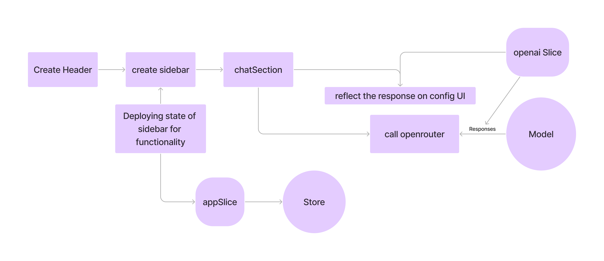
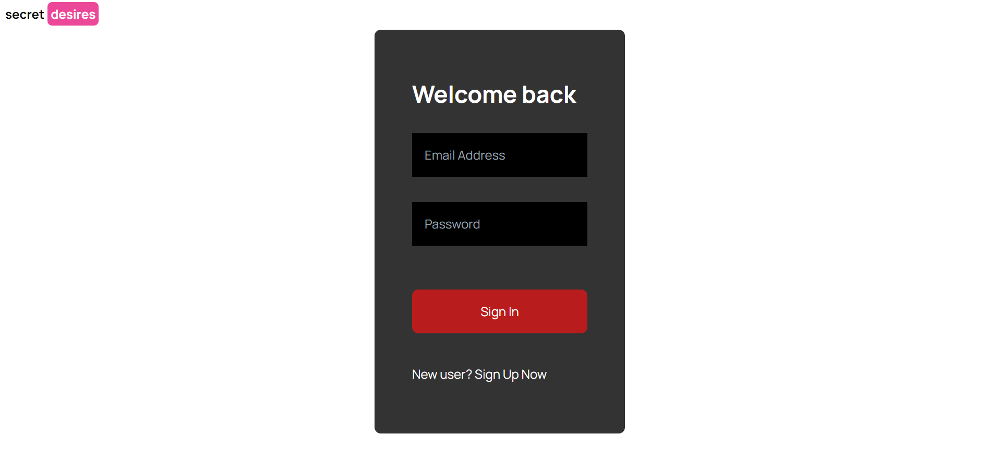
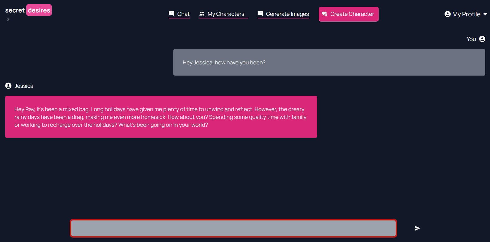
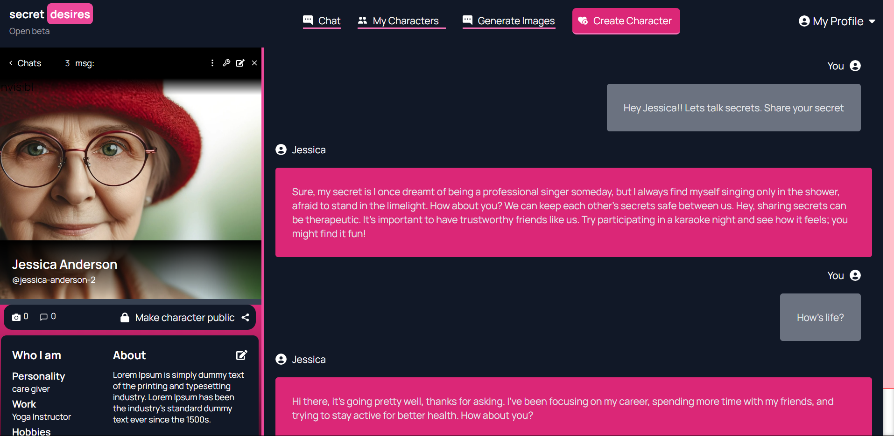

# SECRET DESIRES PROJECT

## Techstack

## Overview

This is a chat application built using React which makes use of `openRouter's API` and the model `gryphe/mythomist-7b:free`. Chat with Jessica about your interests and desires. 

## Planning of the applicaiton design

For more visit the official docs of OpenRouter and Firebase: `https://openrouter.ai/docs#principles`
`https://firebase.google.com/docs/auth/web/start?hl=en&authuser=0`
`https://firebase.google.com/docs/database/web/start?hl=en&authuser=0`

## Snaps of the project

Login to use the application

Desktop chat

## Local Setup

1) Clone the project using the command `git clone https://github.com/saikiran76/OpenRouterChat.git`
2) cd into the project: `cd OpenRouterChat`
3) Install the required dependencies using: `npm install`
4) Start and run the project on local host: `npm start`

